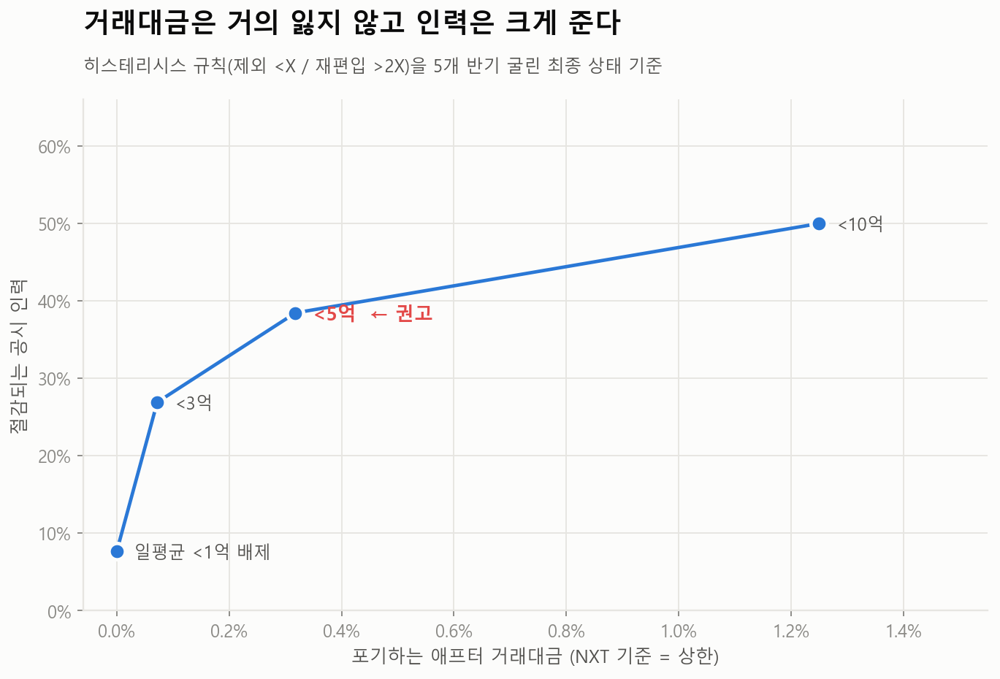

# 제안: 애프터마켓 저유동성 종목 배제 기준

> **근거는 [REPORT.md](REPORT.md)에 있다.** 이 문서는 **무엇을 하자는 것인가**만 담는다. 분석 기간 2024-01-01 ~ 2026-06-30 (거래일 606일) · 코스닥 보통주 1,683종목

---

## 제안

> ## **직전 반기 일평균 거래대금 5억원 미만 종목은 애프터마켓에서 배제한다.**
> ## **재편입은 10억원을 넘을 때 한다.**
> ## **정규장 거래는 그대로 유지한다.**

| | 전종목 편입 | **제안** |
| --- | --- | --- |
| 애프터 편입 종목 | 1,683 | **1,045** (638 배제) |
| 공시 담당 인력 | **25명 / 연 25억** | **15명 / 연 15억** |
| 포기하는 애프터 거래대금 | - | **0.32%** |
| 애프터 시간대 공시 부담 | 100% | **66.9%** (33.1% 절감) |

**애프터 거래대금의 0.32%를 포기하고, 공시 인력의 40%(연 10억)를 줄인다.**

> ⚠ **인력·금액은 "담당자 1인 = 70종목 · 연 1억원"이라는 가정에서 나온다** (REPORT [참고사항](REPORT.md#참고사항)). 거래소 실제 수치를 넣으면 금액은 비례해 움직인다. **배제 종목수(638)와 포기 거래대금(0.32%)은 가정과 무관한 실측치다.**

강도 조절:

| | 제외 종목 | 포기 애프터 거래대금 | 필요 인력 |
| --- | --- | --- | --- |
| 보수안 (3억 컷) | 451 | **0.07%** | 18명 |
| **권고 (5억 컷)** | **638** | **0.32%** | **15명** |
| 적극안 (10억 컷) | 882 | 1.25% | 12명 |

---

## 왜 유동성 기준인가: 다른 기준은 작동하지 않는다

| 후보 기준 | 결과 | 판정 |
| --- | --- | --- |
| **일평균 거래대금** | 포기 애프터 거래대금 0.32% · 절감 큼 | **채택** |
| 시가총액 < 500억 | **정규장 거래대금 9.0% 포기** | 기각 |
| 불성실공시법인 등 질적 기준 | **애프터 거래대금 16.4% 포기** | **기각** |
| Amihud 상위 30% | 포기 0.01% · 절감 큼 | 보조 채택 |

> ### ⚠ **"부실기업을 더 걸러내자"는 직관은 작동하지 않는다.**
> 부실 지정 종목을 추가로 배제하면 애프터 거래대금의 **16.4%** 가 함께 날아간다. **부실기업이라도 투기적으로는 활발히 거래되기 때문이다.** 시가총액 기준도 마찬가지로 정규장 거래대금 9.0%를 포기하게 된다.
>
> **거래대금을 거의 잃지 않으면서 인력을 줄이는 기준은 유동성뿐이다.**

---

## 기준선을 하나만 두면 안 된다

단일 기준("5억 미만 제외")은 기준선 근처 종목이 반기마다 들락날락한다. **제외 명단이 반기마다 44% 물갈이된다.**

| | 제외 명단 물갈이율 |
| --- | --- |
| 5억 미만 제외 (단일 기준) | 44.3% |
| **5억 미만 제외 / 10억 초과 시 재편입** | **30.2%** |

**제외 기준과 재편입 기준을 다르게 둔다(히스테리시스).** 그래야 명단이 안정된다.

---

## 제도 설계

- **기준 사전 공표 + 반기 정기 리밸런싱.** 자의적 배제라는 비판을 차단한다.
- **신규상장·재상장은 6개월 유예.** 거래이력이 없으므로 무조건 편입하고 첫 심사를 기다린다.
- **정규장 거래는 그대로 유지한다.** 애프터 세션만 배제한다. 투자자 접근권은 침해되지 않는다.

---

## 예상 반론

| 반론 | 답 |
| --- | --- |
| **"기준선을 오가는 종목이 많아 혼란스럽다"** | **재편입 기준을 따로 두면 물갈이율이 44% → 30%로 떨어진다.** 기준을 사전 공표하므로 예측 가능하다 |
| **"투자자 접근권 침해다"** | **정규장 거래는 그대로다.** 애프터 세션만 제외한다 |
| **"열어주면 거래가 생긴다"** | **영리 사업자인 NXT조차 선별했다.** 하위 3구간 491종목 중 NXT에서 거래되는 것은 11개뿐 |
| **"거래소는 공적 기관이니 전종목이 맞다"** | **1억원 주문에 주가가 1.6% 급변하는 종목이다.** 공적 기관일수록 배제해야 한다 |

나머지 반론(공시 부담·기존 지정제도와의 관계 등)은 **[REPORT.md §6](REPORT.md)** 참조.

---

## 이 제안이 서는 근거 (요약)

| | 근거 | 상세 |
| --- | --- | --- |
| 1 | **거래는 조금밖에 안 된다.** 하위 절반(841종목)이 거래대금의 **6.8%** | REPORT §2 |
| 2 | **그럼에도 공시는 그대로 나온다.** 거래대금 100억원당 공시 부담 **143배** | REPORT §3 |
| 3 | **그 공시엔 즉시 거래를 멈춰야 하는 것이 섞여 있다.** 뉴스형 정지 604건 중 **67.4%가 15:40 이후** | REPORT §3-2 |
| 4 | **영리 사업자는 이미 선별했다.** NXT 하위 3구간 491종목 중 **11개** | REPORT §2 |
| 5 | **게다가 위험하다.** D10은 1억원 주문에 주가가 **1.65%** 움직인다 (D1의 61배) | REPORT §5 |

**수익 측면에서도, 투자자 보호 측면에서도 같은 결론을 향한다.**
