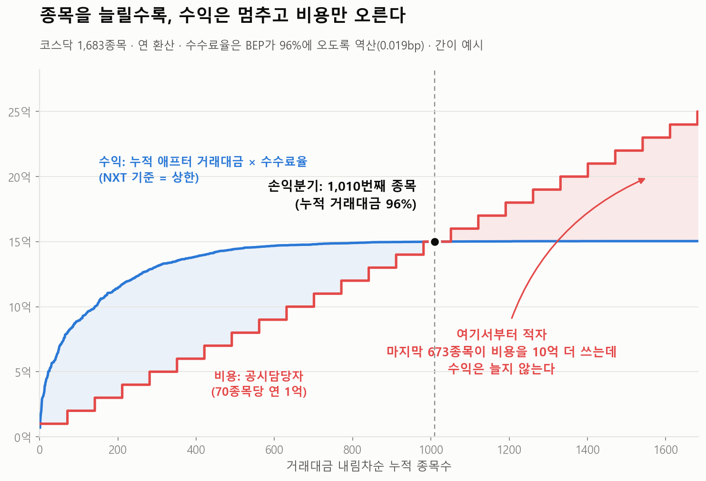
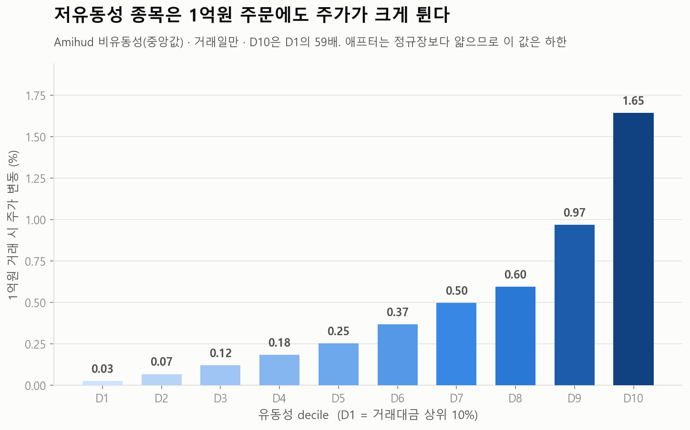

# 애프터마켓, 코스닥 전종목이어야 하는가

**저유동성 종목은 기준을 정해 배제해야 한다: 데이터가 말하는 것**

분석 기간 2024-01-01 ~ 2026-06-30 (거래일 606일) · KOSCOM CHECK API 전수 수집 · 분석대상 **코스닥 보통주 1,683종목**

---

## 한 문장

> **코스닥 보통주를 유동성 기준 10개 그룹으로 나누면, 최상위 그룹(D1, 169사)과 최하위 그룹(D10, 169사)은 거래대금이 235배 차이 나는데 수시공시 건수는 1.6배밖에 차이 나지 않는다. 결과적으로 거래대금 100억원당 수시공시는 D10이 D1그룹 대비 143배, 거래정지를 수반한 공시는 161배 많다.**

---

> **분석대상 종목**: 코스닥 보통주 **1,683종목** (상장폐지 14종목 포함). 거래소가 애프터에서 빼기로 한 투자경고·투자위험·관리종목·투자주의환기와 매매거래정지는 **(종목, 거래일) 단위로 제외**했다. 확정 방법과 제외 규칙의 상세 명세는 **[부록 A](#부록-a-분석대상-종목-확정) · [부록 B](#부록-b-거래일-제외-규칙-재현용-상세-명세)**.

---

## 목차

**본문**

1. [문제의 구조](#1-문제의-구조)
2. [거래는 조금밖에 안 된다](#2-거래는-조금밖에-안-된다) · 하위 절반이 만드는 거래대금은 6.8%
3. [그럼에도 공시는 그대로 나온다](#3-그럼에도-공시는-그대로-나온다) · 단위 거래대금당 부담 143배
   - [3-2. 그 공시의 상당수는 "즉시 거래를 멈춰야 하는" 공시다](#3-2-그-공시의-상당수는-즉시-거래를-멈춰야-하는-공시다) · 저녁에 터지는 뉴스형 정지 연 163건
4. [결국 수익과 비용이 어긋난다](#4-결국-수익과-비용이-어긋난다) · 손익분기 1,010번째 종목
5. [게다가, 위험하다](#5-게다가-위험하다) · 1억원 주문에 1.65%
6. [예상 반론](#6-예상-반론)
- [참고사항](#참고사항) · 가정과 한계

**부록 (재현용)**

- [부록 A. 분석대상 종목 확정](#부록-a-분석대상-종목-확정)
- [부록 B. 거래일 제외 규칙 (상세 명세)](#부록-b-거래일-제외-규칙-재현용-상세-명세)
- [부록 C. "체결이 없는 날": 하루도 없다](#부록-c-체결이-없는-날-하루도-없다)
- [부록 D. 거래정지 사건 분류](#부록-d-거래정지-사건-분류-재현용)
- [부록 E. Amihud 비유동성](#부록-e-amihud-비유동성-재현용)

---

## 1. 문제의 구조

수익은 **거래대금**에서 나오고, 비용은 **공시건수**에서 나온다. 이 둘이 같은 선상에서 비교되지 않으면 문제가 된다.

---

## 2. 거래는 조금밖에 안 된다

| | D1 | D2 | D3 | D4 | D5 | D6 | D7 | D8 | D9 | **D10** |
| --- | --- | --- | --- | --- | --- | --- | --- | --- | --- | --- |
| **종목 수** | 169 | 168 | 168 | 168 | 169 | 168 | 168 | 168 | 168 | 169 |
| 일평균 거래대금 | **340.9억** | 101.2억 | 57.6억 | 34.6억 | 22.5억 | 15.2억 | 9.9억 | 6.4억 | 3.7억 | **1.45억** |
| 시장 전체 거래대금 점유 | **53.9%** | 18.0% | 10.5% | 6.5% | 4.3% | 2.8% | 1.8% | 1.2% | 0.7% | **0.3%** |
| **누적 점유율 (D1→)** | **53.9%** | 71.8% | 82.4% | 88.9% | 93.2% | 96.0% | 97.8% | 99.0% | 99.7% | **100.0%** |

전체종목 1,683종목 중 **하위 절반(841종목)이 만드는 거래대금은 전체의 6.8%다.**

> ※ **거래대금 점유는 일평균 × 종목수와 정확히 비례하지 않는다.** 점유는 **기간 합계**로 재는데, D1에는 투자경고 지정으로 편입가능일이 깎인 종목이 몰려 있어(부록 B 민감도 검정: 투자경고 배제 종목 431개 중 D1이 80개) 종목당 편입가능일이 D1 473일 · D10 584일로 벌어진다. 표의 두 행은 각각 맞고, 곱해서 맞추려 하면 어긋난다.

### 애프터 시장에서는 그마저도 사라진다

경쟁사인 넥스트레이드(NXT)는 **철저히 수익성을 중심으로 운영**된다. 돈을 벌어야 하는 사업자가 실제로 어느 종목을 거래시키는지가 여기서 드러난다.

| | D1 | D2 | D3 | D4 | D5 | D6 | D7 | D8 | D9 | **D10** |
| --- | --- | --- | --- | --- | --- | --- | --- | --- | --- | --- |
| **구간 내 종목 수** | 167 | 167 | 164 | 167 | 169 | 164 | 160 | 162 | 163 | 166 |
| **NXT에서 거래된 종목 수** | 149 | 126 | 98 | 59 | 58 | 34 | 15 | **7** | **4** | **0** |
| **NXT 거래 종목 비율** | 89.2% | 75.4% | 59.8% | 35.3% | 34.3% | 20.7% | 9.4% | **4.3%** | **2.5%** | **0.0%** |

> ※ **"구간 내 종목 수"의 합은 1,649로 분석대상 1,683과 다르다.** NXT는 **2025-03-24 개시**라, 침투율은 **NXT 개시 이후 KRX에서 거래된 종목**만 놓고 잰다(그 전에 상장폐지·장기정지된 34종목은 비교 대상이 없다). 산출: `output/h1_nxt_penetration.csv`.

> **하위 3개 구간 491종목 중, NXT에서 거래되는 것은 11개다.**

넥스트레이드에서는 겨우 11개만 거래되는데, 491개 종목 전체를 KRX 애프터마켓에서 거래할 경우, 거래소 공시담당자 **7.0명**이 필요하다(담당자당 70종목, [가정](#참고사항)). 분석대상 기준 D8~D10 전체(505종목)로 세면 **7.2명**이다.

---

## 3. 그럼에도 공시는 그대로 나온다

| | D1 | D2 | D3 | D4 | D5 | D6 | D7 | D8 | D9 | **D10** | D1÷D10 |
| --- | --- | --- | --- | --- | --- | --- | --- | --- | --- | --- | --- |
| **종목 수** | 169 | 168 | 168 | 168 | 169 | 168 | 168 | 168 | 168 | 169 | - |
| 일평균 거래대금 | **340.9억** | 101.2억 | 57.6억 | 34.6억 | 22.5억 | 15.2억 | 9.9억 | 6.4억 | 3.7억 | **1.45억** | **235배** |
| **종목당 연간 수시공시** | **20.6건** | 19.3건 | 17.0건 | 18.4건 | 18.1건 | 21.1건 | 19.8건 | 20.5건 | 16.0건 | **12.9건** | **1.60배** |
| **거래대금 100억원당 수시공시** | **0.025건** | 0.080건 | 0.121건 | 0.217건 | 0.325건 | 0.550건 | 0.773건 | 1.28건 | 1.74건 | **3.57건** | **143배** |

거래는 235분의 1인데, 공시는 1.60분의 1이다.

> ※ **셋째 행은 구간 합계로 계산했다** (구간 총 공시 ÷ 구간 총 거래대금). 위 두 행은 **종목별 평균**이라 집계 층위가 다르다. 그래서 두 행의 배수를 나눈 값(235 ÷ 1.60 = 147)과 셋째 행의 배수(143)는 3% 차이가 난다. 셋째 행이 "구간이 실제로 버는 돈 대비 실제로 내는 공시"다. 산출: `scripts/analyze_h2.py` → `output/h2_decile.csv`.

### 그래서 단위 거래대금당 부담은 143배가 된다

**거래대금 100억원을 만드는 동안, D1은 공시를 0.025건 내고 D10은 3.57건을 낸다.** 즉, **"버는 돈에 비해 공시가 너무 많다."**

### 공시의 6할은 애프터 시간대에 나온다

편입가능일 기준 코스닥 수시공시 71,972건 중 **41,887건(58.2%)이 15:40~20:00에 발표된다.** 애프터마켓을 열면 이 물량이 **실시간 심사·감시 대상**이 된다. 이것이 애프터 개설로 새로 생기는 증분 부담이다.

---

## 3-2. 그 공시의 상당수는 "즉시 거래를 멈춰야 하는" 공시다

앞 절은 공시를 **세었다.** 이 절은 그중 **거래소가 실제로 거래를 멈춘 것**만 본다. 내가 키워드로 고른 것이 아니라 **거래소 자신이 "즉시 멈춰야 한다"고 판단한 사건**이다.

코스닥 매매거래정지 **910건**(2년 6개월·577종목) 중, **사건이 터진 그 시각에 정지를 걸어야 하는 것**이 **604건**이다. 나머지 306건은 이미 공표된 절차를 예정대로 집행하는 것이라 새로 판단할 게 없다. (둘을 가르는 방법과 사유 전목록은 **[부록 D](#부록-d-거래정지-사건-분류-재현용)**.)

| 뉴스형 정지 604건 | 정지 | 종목 | 애프터 | 무엇인가 |
| --- | --- | --- | --- | --- |
| **부실·위험** | **301** | 223 | **75%** | 상장폐지 사유발생 · 실질심사 · 관리종목 지정 · 불성실공시법인 지정 · 영업정지 · 회생·파산 · 풍문·보도 |
| **절차 개시 결정** | 271 | 248 | 62% | 무상증자 · 감자 · 합병 · 영업양수도: **결정 공시 시점에 30분 정지가 걸린다** |
| **대형계약** | 32 | 20 | 38% | 단일판매·공급계약 (100억원 이상 **&** 전년 매출액 100% 초과) |

> ### **뉴스형 604건 중 407건(67.4%)이 15:40 이후에 터진다.**
> 애프터마켓을 열면 이것은 심사 대상이 아니라 **실시간 정지 조치 대상**이다. 연 163건, **거래일당 0.67건** 꼴로 저녁에 정지 버튼을 눌러야 한다.

**나쁜 소식일수록 밤에 나온다.** 상장폐지 사유발생은 **94%**, 불성실공시법인 지정은 **100%** 가 15:40 이후다. 반대로 호재인 무상증자는 **30%** 만 애프터에 나온다.

### 그리고 그 부담은 거래가 없는 쪽에 쏠린다

| | D1 | D2 | D3 | D4 | D5 | D6 | D7 | D8 | D9 | **D10** |
| --- | --- | --- | --- | --- | --- | --- | --- | --- | --- | --- |
| **뉴스형 정지** | 32 | 43 | 31 | 38 | 34 | 52 | **59** | 47 | 37 | 27 |
| 그중 애프터 | 18 | 23 | 16 | 17 | 21 | 36 | **45** | 34 | 25 | 15 |
| 시장 거래대금 점유 | **53.9%** | 18.0% | 10.5% | 6.5% | 4.3% | 2.8% | 1.8% | 1.2% | 0.7% | **0.3%** |
| **거래대금 1조원당 정지** | **0.0117** | 0.0473 | 0.0580 | 0.115 | 0.156 | 0.364 | 0.640 | 0.774 | 1.05 | **1.89** |

> ### **거래대금 1조원당 뉴스형 정지: D10이 D1의 161배.**
> **하위 절반(841종목)이 거래대금의 6.8%를 만들면서, 뉴스형 정지의 55.6%를 낸다.** 즉, **버는 돈에 비해 정지가 잦다.**

*(분석대상 밖 204건은 상장폐지·스팩·장기정지 종목이라 decile을 매길 수 없다. 위 표는 분석대상 400건 기준.)*

### 실제로 저녁에 벌어진 일

아래는 **전부 편입 대상인 정상 종목**이다. 관리종목·환기종목으로 지정돼 있지도 않았고, 그 이전에 정지돼 있지도 않았다. 평소엔 **매일** 거래되는데 하루 몇억 원어치이고, 그러다 저녁에 이 소식이 터졌다.

| 종목 | 일평균 거래대금 | | 저녁에 터진 공시 | 그래서 걸린 정지 |
| --- | --- | --- | --- | --- |
| **더코디** | **0.8억** | D10 | 19:09 · **조회공시요구(채권자에 의한 파산신청설)** | 풍문 또는 보도 관련 |
| **유성티엔에스** | **2.3억** | D10 | 17:16 · **영업정지** | 중요한 영업정지 |
| **스타코링크** | **2.5억** | D10 | 16:54 · **내부결산시점 관리종목 지정ㆍ상장적격성 실질심사 사유 발생** | 관리종목 지정우려 |
| **웰크론한텍** | **2.6억** | D9 | 17:42 · **영업정지** | 중요한 영업정지 |
| **한국유니온제약** | **3.2억** | D9 | 16:33 · **횡령ㆍ배임혐의발생** | 상장적격성 실질심사 |
| **더테크놀로지** | **5.8억** | D8 | 18:59 · **상장폐지 관련 안내** | 사업보고서 미제출 |
| **DMS** | **5.9억** | D8 | 19:26 · **관리종목지정(상장폐지사유 발생)** | 상장폐지 사유발생 |
| **삼천리자전거** | **6.8억** | D8 | 17:19 · **상장적격성 실질심사 관련 안내** | 상장적격성 실질심사 |

전수 목록은 **`output/halt_events.csv`**: 910건 전부에 종목명·시각·decile·정지사유·유발공시가 붙어 있다.

---

## 4. 결국 수익과 비용이 어긋난다



거래대금 내림차순으로 종목을 **하나씩 늘려가며** 수익과 비용을 쌓은 그림이다.

* **수익(파란 선)** = 누적 애프터 거래대금 × 수수료율. 분모는 NXT(프리+메인+애프터 **합계**)라 애프터 단독 수익보다 **크다.** 즉 **후하게 잡아준 상한**이다.
* **비용(빨간 계단)** = 공시담당자. **70종목마다 1억씩** 계단으로 오른다.

> ### ⚠ 비용 가정: **담당자 1인 = 70종목 · 연 1억원**
>
> 이것은 **가정**이다. 거래소 내부 수치가 아니다. 이 보고서의 인력·금액은 **전부 여기서 파생**된다. 분석대상 1,683종목 → 25명 → 연 25억, 손익분기 오른쪽 673종목 → 10억.
>
> **실제 수치를 넣으면 종목수와 금액은 비례해 움직인다.** 그러나 아래 그림의 **구조**(수익선은 평평해지고 비용선은 끝까지 계단으로 오른다)는 담당자 1인이 50종목이든 100종목이든 바뀌지 않는다.

**수익선은 상위 1,000종목쯤에서 이미 평평해진다.** 더 넣을 종목에 거래가 거의 없기 때문이다. 그런데 **비용선은 70종목마다 계속 1억씩 올라간다.** 두 선이 만나는 곳이 손익분기다.

> ### **손익분기 = 1,010번째 종목 (누적 거래대금 96%).**
> **그 오른쪽 673종목은 비용을 10억 더 쓰는데, 수익은 늘지 않는다.**

### ⚠ 이 그림은 간이 예시다: 그렇게 읽어야 한다

**수수료율은 우리가 확정할 수 없다.** 위 그림은 **손익분기가 누적 거래대금 96% 지점에 오도록 수수료율을 역산해서** 그린 것이다(0.019bp). **다른 값을 넣으면 손익분기 지점은 움직인다.**

**그럼에도 그림의 요지는 수수료율과 무관하다.** 요지는 두 선의 **모양**이다.

> **수익선은 어느 지점부터 평평해지고, 비용선은 끝까지 계단으로 오른다.** 수수료율을 어떻게 잡든 **손익분기는 존재하고, 그 오른쪽은 적자다.** 수수료율은 그 지점이 **어디냐**를 바꿀 뿐, **있느냐**를 바꾸지 못한다.

거래소 내부 수수료율을 넣으면 손익분기 종목수가 **확정 수치로** 나온다. 그 계산은 이 보고서가 아니라 거래소가 해야 한다. 이 그림이 보이는 것은 **"어디선가 반드시 적자로 돈다"** 는 구조다.

**수수료율을 가정하지 않는 또 하나의 방법**은 거꾸로 묻는 것이다. **"담당자 1인을 회수하려면 수수료율이 몇 %여야 하는가."**

> **NXT에서 단 한 번이라도 거래된 코스닥 종목은 550개뿐이다. 나머지 1,133종목의 애프터 거래대금은 0이다.** **분모가 0이므로, 어떤 수수료율로도 회수되지 않는다.** 이 1,133종목을 맡는 데만 공시담당자 **17명**이 든다(`output/h4_rules.csv`). **여기엔 수수료율 가정이 없다.**

---

## 5. 게다가, 위험하다



**Amihud 비유동성**: **1억원어치 거래가 주가를 몇 % 움직이는가.** Amihud(2002) 이래 **학계 표준 비유동성 지표**이며, 일별 시세만으로 시장충격을 근사한다. 정의·공신력·계산상의 함정은 **[부록 E](#부록-e-amihud-비유동성-재현용)**.

| | D1 | D2 | D3 | D4 | D5 | D6 | D7 | D8 | D9 | **D10** |
| --- | --- | --- | --- | --- | --- | --- | --- | --- | --- | --- |
| **1억원 거래 시 주가 변동** | **0.027%** | 0.069% | 0.12% | 0.18% | 0.25% | 0.37% | 0.50% | 0.60% | 0.97% | **1.65%** |

**하위 종목은 5천만원 주문에 0.82%, 1억원 주문에 1.65% 움직인다. 상위의 61배다.** 즉, **적은 돈으로 움직인다.**

> ⚠ **"저유동성 종목은 변동성이 크다"고 말하면 반박당한다.** 일간 변동성·일중 변동폭·극단 수익률은 **전부 D1이 더 크다**(코스닥 대형주 = 테마·바이오 고변동주). 성립하는 명제는 **"적은 돈으로 움직인다"** 하나뿐이고, 그것을 재는 지표가 Amihud다. 상세는 **[부록 E](#부록-e-amihud-비유동성-재현용)** §E-3.

**정규장에서조차** 이 정도인데 **애프터 세션은 정규장보다 유동성이 더 얇다.** 따라서 애프터에서의 위험은 위 수치보다 **반드시 더 크다.** 애프터 데이터를 보지 않아도 결론이 명확하다.

### 이것이 투자자 보호 논거의 마지막 조각이다

§3-2에서 본 것과 여기서 본 것을 겹쳐 놓으면 그림이 완성된다.

> **하루 8천만 원 거래되는 종목에서, 저녁 7시에 파산신청설 조회공시가 나온다** (더코디, §3-2). **그 종목은 원래도 1억원 주문에 주가가 2.5% 움직이는 종목이었다** (더코디의 Amihud = 2.54. D10 중앙값 1.65보다도 얇다. 출처는 `output/h5_stock.csv`). **정규장에서 그렇다. 그렇다면 애프터에서는?**

**얇은 호가창 · 나쁜 소식 · 감시가 옅은 시간대**가 한 점에서 만난다. 정규장이라면 다음 날 아침 충분한 유동성 속에서 조정될 사안이, 애프터마켓에서는 **소수의 주문만으로 급격히 무너지는 상황**이 된다. 그리고 거래소는 **바로 그 시각에 정지 버튼을 눌러야 한다**: 저녁에 터지는 뉴스형 정지가 연 163건이다.

거래소가 공적 기관이라는 사실은 전종목 편입의 근거가 아니라 **배제의 근거**다.

---

## 6. 예상 반론

| 반론 | 답 |
| --- | --- |
| "열어주면 거래가 생긴다" | **영리 사업자인 NXT조차 선별했다.** 하위 491종목 중 NXT 거래는 11개뿐 |
| "거래소는 공적 기관이니 전종목이 맞다" | **1억원에 1.6% 급변하는 종목이다.** 공적 기관일수록 배제해야 한다 |
| "공시는 애프터와 무관하게 어차피 한다" | 수시공시의 **58.2%가 15:40~20:00**에 나온다. 게다가 그중엔 **즉시 거래를 멈춰야 하는 것**이 섞여 있다: **뉴스형 정지 604건 중 407건(67.4%)이 15:40 이후** |
| "잡주가 공시를 더 내는 건 아니잖나" | **맞다.** 절대 건수는 대형주가 1.60배 많다. 문제는 **버는 돈 대비 143배** |
| "이미 관리·환기·경고·위험은 빼기로 했다" | **그건 일자 단위로 다 반영한 숫자다**(부록 A·B). 그럼에도 **유동성 기준이 없어** 이 문제가 남는다 |
| **"그래서 어떻게 하자는 것인가"** | **[PROPOSAL.md](PROPOSAL.md)** 로 답한다. 요지: **직전 반기 일평균 거래대금 5억원 미만은 애프터에서 배제, 재편입은 10억원 초과 시, 정규장 거래는 그대로.** 애프터 거래대금 **0.32%** 를 포기하고 공시 인력 **40%(연 10억)** 를 줄인다 |

---

## 참고사항

- **⚠ 이 보고서의 유일한 비용 가정: 공시담당자 1인 = 70종목 · 연 1억원.** 거래소 내부 수치가 아니다. **인력·금액 수치는 전부 여기서 파생된다**(1,683종목 → 25명 = 연 25억, 손익분기 오른쪽 673종목 → 10억, PROPOSAL의 절감 10억). 실제 수치를 넣으면 금액은 비례해 움직이지만, §4의 **구조**(수익선은 평평해지고 비용선은 계단으로 오른다)는 바뀌지 않는다.
- **§4의 손익 그림(fig1)은 간이 예시다.** 수수료율을 확정할 수 없어, **손익분기가 누적 거래대금 96%에 오도록 역산**해 그렸다(0.019bp). 다른 수수료율을 넣으면 **손익분기 지점은 움직인다.** 그림이 보이는 것은 특정 손익분기 종목수가 아니라 **"수익선은 평평해지고 비용선은 계단으로 계속 오르므로, 어디선가 반드시 적자로 돈다"** 는 구조다. **수익 규모를 주장하는 근거로 인용하지 말 것.** 수수료율 가정 없이 성립하는 것은 **"애프터(NXT) 거래대금이 0인 1,133종목"** 뿐이다(분모가 0이라 어떤 수수료율로도 회수되지 않는다).
- **NXT 거래대금은 애프터 단독이 아니라 프리+메인+애프터 합계다.** 애프터 수익의 **상한**으로만 썼다. 모든 결론이 "상한으로 잡아도 회수가 안 된다"는 형태이므로, 실제로는 더 강하게 성립한다.
- 애프터 세션을 **15:40~20:00**으로 가정했다.
- **좌측 절단**(2024-01-01 이전부터 지정·정지)은 둘 다 처리했다. **지정**은 `gongsi_jong`으로 과거 지정 공시를 확인해 31종목의 지정 기간을 제외했고(규칙 A-9), **정지**는 '전 기간 체결 0건' 가드로 걸러냈다(부록 A ※2).
- **매매거래정지는 공시(`주권매매거래정지` → `해제`) + 거래량으로 복원**했다. 정지 공시일은 무조건 제외하고(장중 정지), 구간 안의 무거래일과 재개 시점은 거래량으로 확정한다(부록 B 규칙 B).

---

## 부록 A. 분석대상 종목 확정

거래소는 애프터마켓에서 **투자경고 · 투자위험 · 관리종목 · 투자주의환기 · 초저유동 · 투자유의** 종목을 거래하지 않기로 했다. 따라서 이들을 **제외**한다.

**⚠ 종목 단위가 아니라 일자 단위로 걸러야 한다.** 투자경고·투자위험은 지정 기간이 짧다(중앙 **10~11 거래일** · 약 2주. 부록 B 사유별 표). 종목을 통째로 빼면 분석대상가 과도하게 깎이고, 통째로 넣으면 지정 기간의 거래·공시가 섞여 든다. → 공시에서 지정·해제 이력을 복원해 **(종목, 일자) 단위 편입가능 마스크**를 만들었다(`status.py`).

**출발점은 "현재 상장 종목"이 아니라 "그날 상장돼 있던 종목"이다.** `rank_invest_date`는 조회일 시점에 상장돼 있던 전 종목을 주므로 **기간 중 상장폐지된 종목이 그대로 들어 있다.** 여기서 아래를 빼나간다.

| 걸러낸 것 | 규모 |
| --- | --- |
| 지정·정지 상태 종목-일 (경고·위험·관리·환기 · 매매거래정지 · 초저유동 · 스팩합병 전) | 종목-일의 **7.7%** (83,385 / 1,078,373) · 공시의 **18.0%** |
| 스팩 <sup>※1</sup> | 173종목 |
| 우선주 <sup>※2</sup> | 3종목 |
| 편입가능일 120일 미만 <sup>※3</sup> | 78종목 |
| 전 기간 체결 0건 <sup>※4</sup> | 1종목 |
| **최종 분석대상** | **1,683종목** (상장폐지 14 포함) **→ 공시담당자 25명 = 연 25억** (담당자 1인 = 70종목 · 연 1억 **가정**) |

> **※1. 스팩 제외는 두 단계다.** `F33792`(기업인수목적회사여부)는 `code_info`(**현재 상장분**)에서 오므로 **합병으로 소멸한 스팩은 플래그가 없다.** 실제로 그런 스팩이 **81종목** 있었고, **전부 D10에 깔려** "저유동성 종목"으로 집계되고 있었다. → 상폐 종목은 **공시 제목의 회사명**으로 판정한다(앞머리 28자에 `기업인수목적`·`스팩`이 든 공시가 과반). 현재 상장분엔 이 규칙을 쓰지 않는다. **스팩 합병으로 상장한 정상 기업**이 오판되는 걸 막기 위해서다.
>
> **스팩존속합병**(스팩 코드가 유지되고 회사명만 바뀜)은 **합병 전 기간만** 제외한다(부록 B 규칙 D).

> **※2. 우선주는 분석 대상이 아니다.** ⚠ `F34501`(증권그룹ID)은 **우선주도 `ST`로 준다.** CHECK API엔 보통주/우선주 플래그가 없어, KRX 코드 규약(보통주 = 끝자리 0)으로 판정했다. KRX `listed_stocks`의 `KIND_STKCERT_TP_NM`과 **100% 일치** 확인. 코스닥 우선주는 **3종목**뿐이다(대호특수강우 021045 · 소프트센우 032685 · 해성산업1우 03481K).

> **※3. "편입가능일 120일 미만"은 두 부류를 동시에 잡는다.** 목적은 하나, **관측이 부족해 유동성을 측정할 수 없는 종목 제거**다. ① **신규상장 등** (상장일수 자체가 짧음). 상장 첫날 폭발 거래로 일평균이 왜곡되고(하루 7,950억 사례), 공시를 낼 시간도 없어 건수가 0에 가깝다. ② **장기 지정·정지** (상장은 606일인데 편입가능일이 깎임). 관리종목·정지로 대부분을 보낸 종목. 남은 며칠로는 유동성을 측정할 수 없다.

> **※4. 편입가능일이 있는데 체결이 0건인 종목.** **2024-01-01 이전부터 매매거래정지 중**이라 정지 공시가 데이터 기간 밖이고, 규칙 B가 구간을 열지 못한 잔여분이다. 마지막 가드로 제외한다.

### (참고사항) 실측으로 확인한 것

- **초저유동종목은 코스닥 보통주에 사실상 없다.** 저유동성종목 단일가매매 공시는 4건·2종목이고 **전부 우선주**다(대호특수강우·소프트센우). **투자유의종목은 코넥스 제도**로 코스닥엔 0건이다. → **거래소가 정한 6개 유형 중 코스닥 보통주에 실제로 걸리는 것은 넷뿐이고, 유동성 기준은 사실상 없다.**

**제외 규칙의 상세 명세는 부록 B** 에 있다. 어떤 공시가 어떤 거래일을 제외시키는지, 사유별 실제 사례와 공시 본문 대조 검증까지.

---

---

## 부록 B. 거래일 제외 규칙 (재현용 상세 명세)

구현: `scripts/status.py`. 아래 규칙에 걸린 **(종목, 거래일)** 쌍은 애프터 사업의 **수익(거래대금)과 비용(공시) 어느 쪽에도 들어가지 않는다.**

**공통 전제**
- 대상 공시: `gongsi_basic` 중 **`MTVCD = 320`(코스닥)** 이고 종목코드(`NCD`)가 있는 건.
- 제목 비교 전 **공백을 모두 제거**한다(표기 흔들림 흡수).
- 시장경보·조치류 공시는 **장 마감 후 발표**된다(투자경고 20:01, 관리종목 16:38 등 실측). → **지정 효력은 공시 다음 거래일부터**, 해제 효력은 **공시 당일까지**(= 해제일은 공시 다음 거래일).

### 공시일 → 효력일 규칙을 본문으로 검증했다 (`validate_dates.py`)

**공시일이 곧 효력일은 아니다.** 그래서 공시 **본문**(`gongsi_body`)에 명시된 실제 날짜를 정답으로 삼아, 우리 규칙("공시 다음 거래일")이 맞는지 대조했다. 본문은 이렇게 생겼다:

```
투자경고종목 지정 | 1. 대상종목 | 그린광학 | 2. 지정일 | 2026년 01월 22일
관리종목 지정    | 1.대상종목 | 이화공영 | 3.지정일 | 2026-04-02
```

**⚠ 전수가 아니라 유형별 12건 무작위 표본이다.** (전수는 이벤트 약 2,500건 × 2콜 × rate limit 1.15초로 1시간 이상 걸린다.) 실행 결과는 `output/validate_dates.txt` 에 있다. 표본 12건 중 본문에서 날짜를 못 뽑은 건(양식이 다른 구건)은 분모에서 뺐다. 그래서 투자위험이 6/6, 관리종목 지정이 9/9다.

| 유형 | 검증 내용 | 일치율 |
| --- | --- | --- |
| 투자경고 지정 | 본문 지정일 == 공시일의 **다음 거래일** | **12/12 (100%)** |
| **투자경고 해제** | **본문 해제일 == 공시일의 다음 거래일** | **12/12 (100%)** |
| 투자위험 지정 | 〃 | 6/6 (100%) |
| 관리종목 지정 | 〃 | 9/9 (100%) |
| **관리종목 전체해제** | **본문 해제일 == 공시일의 다음 거래일** | **12/12 (100%)** |
| 환기종목 지정 | 〃 | 12/12 (100%) |

> **즉 경보·지정류는 지정이든 해제든 "공시 다음 거래일"이 효력일이다.** 장 마감 후(20:01, 16:38 등)에 발표되기 때문이다. 그린광학은 해제 공시가 `2026-02-05 20:01`인데 본문상 해제일이 `2026년 02월 06일`이다.
>
> **⚠ 단, 매매거래정지는 다르다.** 원풍물산은 공시가 `2026-04-15`인데 본문상 정지일이 **`2026-04-20`** 이었다(다음 거래일인 4/16이 아니다). 그래서 정지에는 "다음 거래일" 규칙을 쓰지 않고 **공시일 + 거래량**으로 확정한다(규칙 B).
>
> 그래서 **위 표에 매매거래정지 행은 없다.** `validate_dates.txt` 에는 참고로 찍히지만(2/6), 그건 규칙 B가 틀렸다는 뜻이 아니라 **이 대조법으로는 정지를 검증할 수 없다**는 뜻이다: **당일에 풀리는 정지**(무상증자·자본감소 등)는 무거래일을 만들지 않아 "거래량으로 찾은 정지일"이 아예 존재하지 않는다. 규칙 B는 그 경우를 **B-4(공시일 무조건 제외)**로 잡는다.

### 규칙 A: 투자경고 · 투자위험 · 관리종목 · 투자주의환기

| 단계 | 내용 |
| --- | --- |
| A-0 | `기타시장안내` · `우려` 가 들어간 제목은 **버린다.** ("기타시장안내(관리종목지정**우려**종목)" 은 안내이지 지정이 아니다) |
| A-1 | `(정정)` 공시는 **새 구간을 열지 않는다.** 정정 공시의 본문 날짜는 **원래(과거) 지정·해제일**이라, 공시일로 이벤트를 만들면 구간이 어긋난다. 원 공시가 이미 처리돼 있다. |
| A-2 | 제목에 `투자경고종목` / `투자위험종목` / `관리종목` / `투자주의환기종목` 중 하나가 포함된 공시를 뽑는다. |
| A-3 | **`해제` 포함 AND `일부해제` 미포함 → 해제 이벤트.** (**가장 먼저** 판정) |
| A-4 | 해제가 아니면서 `예고` 포함 → **버린다** (순수 지정예고). |
| A-5 | 나머지 → **지정 이벤트.** |
| A-6 | 종목별로 (일자, 시각) 순으로 훑어 **지정 → 해제** 를 짝지어 구간을 만든다. 이미 구간이 열려 있으면 추가 지정은 **무시**(중복 방지). |
| A-7 | **제외 거래일 = [지정 공시일의 다음 거래일 … 해제 공시일]** (양끝 포함). |
| A-8 | 해제 없이 기간이 끝나면 **2026-06-30까지** 지정 상태로 본다. |
| A-9 | **좌측 절단 보정.** 구간이 안 열린 상태에서 **해제를 먼저 만나면** = 분석 기간(2024-01-01) **이전부터 지정돼 있던 종목**이다. → **첫 거래일부터 그 해제 공시일까지** 제외한다. |

> ### ⚠ 함정 1: **`일부해제`는 해제가 아니다** (A-3)
>
> 관리종목·환기종목은 **지정 → 지정사유추가 → 일부해제 → (전체)해제** 순으로 간다. **일부해제는 사유 하나가 풀렸을 뿐 여전히 관리·환기종목이다.**
>
> ``` (주)베스파 관리종목지정사유추가및일부해제(자본잠식률 50% 이상 등) (주)엔지스테크널러지 투자주의환기종목지정사유추가및일부해제(5사업연도 연속 영업손실 발생 등) ```
>
> 실측: **관리종목 해제류 117건 중 46건(39%) · 환기종목 108건 중 21건(19%)이 일부해제**다. 이걸 해제로 처리하면 구간이 조기에 닫혀, 여전히 관리종목인 날이 "편입 가능"으로 들어간다.
>
> ### ⚠ 함정 2: **`해제` 판정을 `예고` 제거보다 먼저** (A-3 → A-4 순서)
>
> 해제 공시의 실제 제목이 **"투자경고종목 지정해제 및 재지정 예고"** 다. 예고를 먼저 걸러내면 **해제 653건 중 대부분이 사라지고 지정 구간이 영영 닫히지 않는다.**
>
> ### ⚠ 함정 3: **`지정예고`는 지정이 아니다** (A-4)
>
> 투자경고 관련 공시 2,802건 중 **2,059건(73%)이 예고**다. 이를 지정으로 세면 대상 종목이 442개 → 730개로 부풀어 오른다.
>
> ### ⚠ 함정 4: **좌측 절단: '해제만 있고 지정이 없는' 종목** (A-9)
>
> 2024-01-01 **이전부터 지정돼 있던 종목**은 지정 공시가 데이터 밖이라 구간이 안 열린다. 그러면 실제로는 관리종목·환기종목인 날들이 **"정상, 편입 가능"으로 잘못 계산**된다.
>
> **탐지는 간단하다. 해제 공시는 있는데 지정 공시가 없으면 그 종목이다.** 분석대상에 31종목이었다. **`gongsi_jong`으로 2020~2023년 공시를 조회해 31종목 전부 과거 지정 공시를 확인했다:**
>
> | 종목 | 과거 지정 |
> | --- | --- |
> | 메디앙스 (014100) | 환기종목 **2020-03-19** |
> | 피엔티엠에스 (257370) | 관리종목 **2021-01-27** (구 명성티엔에스) |
> | 포인트모바일 (318020) | 관리종목 **2022-03-29** |
> | 미코 (059090) · 국일제지 (078130) · 휴림로봇 (090710) 등 | 환기종목 **2023-03~04** |
>
> → A-9로 **첫 거래일부터 해제일까지를 제외**했다. 30종목은 **해제 이후 정상 거래 기간이 충분해 분석대상에 남는다**(일자 단위 처리이므로 당연하다). 1종목만 편입가능일 부족으로 탈락했다. ⚠ `gongsi_jong`은 **`dcnt` 기본값이 100**이라 과거 공시가 잘린다. 반드시 `dcnt`를 올려야 한다.

#### 실제 사례: 규칙 A

**① 투자경고 · 그린광학 (0015G0)**

| | |
| --- | --- |
| 지정 공시 | `2026-01-21 20:01` **(주)그린광학 투자경고종목지정** |
| ↳ **본문 명시 지정일** | **2026년 01월 22일** (= 공시 다음 거래일) |
| 해제 공시 | `2026-02-05 20:01` **(주)그린광학 [투자주의]투자경고종목 지정해제 및 재지정 예고** |
| ↳ **본문 명시 해제일** | **2026년 02월 06일** |
| **제외 거래일** | **11일 (2026-01-22 ~ 2026-02-05)** |

**② 투자위험 · 모베이스전자 (012860)**: 공시 `2026-01-19 20:01` → 본문 지정일 **01-20** · 해제 공시 `2026-02-03` → **제외 11일 (01-20 ~ 02-03)**

**③ 관리종목 · 이화공영 (001840)**: 공시 `2026-04-01 16:38` **관리종목지정(상장적격성 실질심사 대상 결정)** → 본문 지정일 **2026-04-02** · 해제 공시 없음 → **제외 60일 (04-02 ~ 06-30, 기간 끝까지)**

**④ 환기종목 · 이화공영 (001840)**: 공시 `2025-04-02` **투자주의환기종목지정(내부회계관리제도 비적정 등)** → 이후 `2025-10-13` **투자주의환기종목지정사유일부해제** 가 나오지만 **일부해제라 구간을 닫지 않는다.** 전체해제가 없으므로 **2025-04-03 ~ 2026-06-30 전체가 제외**된다. (일부해제를 해제로 잘못 처리하면 127일만 빠지고 나머지가 편입 가능으로 들어간다.)

**⑤ 중복 지정 무시 (A-6) · 위니아 (071460)**

```
2024-02-05  (주)위니아 관리종목지정사유추가(상장적격성 실질심사 대상 결정)   ← 구간 열림
2024-03-26  (주)위니아 관리종목지정사유추가(상장폐지사유 발생)              ← 무시 (이미 열림)
```

### 규칙 B: 매매거래정지

**공시 흐름 (실측)**

| | 건수 | 종목 |
| --- | --- | --- |
| `주권매매거래정지` | **910** | 577 |
| `주권매매거래정지기간변경` | 521 | 131 |
| `주권매매거래정지해제` | **468** | 357 |

| 단계 | 내용 |
| --- | --- |
| B-1 | **정지 이벤트** = `주권매매거래정지` (`해제`·`기간변경`·`(정정)` 제외). |
| B-2 | **`기간변경`은 새 정지가 아니다.** 이미 열린 구간을 연장할 뿐이므로 무시한다. (521건. 이걸 정지로 세면 이벤트가 부풀어 오른다) |
| B-3 | **해제 이벤트** = `주권매매거래정지해제`. 구간 = **[정지 공시일 … 해제 공시일]** (해제 없으면 기간 끝까지). |
| B-4 | **정지 공시일은 무조건 제외한다.** 그날 거래량이 있어도 그날 정지가 걸린 것이다(장중 정지). → **당일·장중 정지가 자동으로 잡힌다.** |
| B-5 | 구간 안의 **무거래일**을 제외한다. **정지 중이면 거래량은 0이다.** |
| B-6 | 구간 끝 = **해제 공시 이후 거래가 다시 붙는 첫날의 전날.** (해제 공시가 마감 후 나면 재개는 다음 거래일이다) |

> ### ⚠ 함정 5: **구간을 통째로 빼면 안 된다**
>
> 해제 공시(468건)가 정지(910건)보다 적어 **짝이 안 맞는 구간이 기간 끝까지 늘어진다.** 구간 전체를 빼면 **57,878 종목-일을 과다 제외**하는데, 그 **100%가 실제로 거래가 있던 날**이다.
>
> 원풍물산도 그렇다. 정지 공시가 4/15인데 **4/16·17에 정상 거래**가 있었고 실제 정지는 4/20부터였다 (본문상 `정지일시 2026-04-20`).
>
> → **공시일은 빼되(B-4), 나머지는 거래량으로 확정한다(B-5).**

#### 실제 사례: 규칙 B

**① 액면병합 (정지가 공시 며칠 뒤에 시작) · 원풍물산 (008290)**

```
공시 2026-04-15  주권매매거래정지(주식의 병합, 분할 등 전자등록 변경, 말소)
  ↳ 본문: 가.정지일시 2026-04-20 | 나.만료일시 신주권 변경상장일 전일까지   ← 종료일이 조건부!
공시 2026-05-11  주권매매거래정지해제(액면병합 주권 변경상장)
```

| | |
| --- | --- |
| B-4 | **2026-04-15** (공시일) 제외 |
| B-5 | **2026-04-20 ~ 05-11** (무거래일) 제외 · **04-16·17은 실제 거래가 있어 남긴다** |
| B-6 | 재개 = 05-12 (거래량 512,488주) |
| **합계** | **제외 15일** |

> 이런 절차적 정지가 전체의 **49%** 다(주식병합 272 · 무상증자 99 · 자본감소 75 = 910건 중 446건). 우량주도 걸리므로 **종목 단위로 빼면 안 된다.**

**② 장중 정지 · 푸른저축은행 (007330)**

```
공시 2026-02-27  주권매매거래정지(상장적격성 실질심사 대상(사유발생))   ← 이날 42,737주 거래됨
공시 2026-04-13  주권매매거래정지해제(상장적격성 실질심사 대상 제외 결정)
```

| | |
| --- | --- |
| B-4 | **2026-02-27** (공시일): **거래가 있었지만 장중 정지이므로 제외** |
| B-5 | **2026-03-03 ~ 04-13** (무거래일) 제외 |
| **합계** | **제외 31일** |

**③ 당일 정지 (무거래일이 없는 경우)**

무상증자(99건)·자본감소(75건)·단일판매공급계약 조회(32건) 등으로 **장중 잠깐 멈췄다 그날 안에 풀린** 정지. 무거래일이 생기지 않지만 **B-4가 공시일을 무조건 빼므로 자동으로 포착**된다.

### 규칙 C: 초저유동 · 투자유의: 코스닥 보통주에 해당 없음

- **초저유동**: `저유동성종목 단일가매매` 공시는 **4건·2종목**이고 **전부 우선주**(대호특수강우·소프트센우).
- **투자유의종목**: **코넥스 제도**로 코스닥엔 **0건**.

### 사유별 제외 규모 (실측)

산출: `scripts/exclusions_audit.py` → `output/exclusions_by_reason.txt` · `.csv`

| 사유 | 지정 공시 | 종목 | 전체해제 | **일부해제(해제 아님)** | **제외 종목-일** | 중앙 지정기간 |
| --- | --- | --- | --- | --- | --- | --- |
| 투자경고 | 740 | 442 | 653 | 0 | 8,512 | 10 거래일 |
| 투자위험 | 81 | 36 | 39 | 0 | 497 | 11 거래일 |
| 관리종목 | 530 | 207 | 71 | **46 (39%)** | **43,358** | **258 거래일** |
| 투자주의환기 | 237 | 161 | 87 | **21 (19%)** | **40,941** | **228 거래일** |
| 매매거래정지 | 910 | 577 | 468 | - | **47,103** | - |
| **합집합** | | | | | **83,385 (전체 종목-일의 7.7%)** · 영향 922종목 | |

**분모는 코스닥 전체 종목-일 1,078,373**(1,969종목 × 606거래일)이다. **제외 종목-일은 그 종목이 실제로 상장돼 있던 거래일과의 교집합으로만 센다.** 마스크 자체는 전 거래일에 대해 만들어지므로(상장 전·상폐 후 날짜 포함) 그대로 세면 116,790으로 부풀고, 분모와 기준이 어긋난다.

구간이 겹치므로 합집합(83,385)은 단순 합(140,411)보다 작다. **관리·환기는 지정 기간이 길어**(중앙 258·228 거래일) **제외일이 압도적**이고, 투자경고는 종목 수는 많지만 지정 기간이 짧아(중앙 10 거래일) 제외일이 적다.

### 왜 종목 단위로 빼지 않는가: 민감도 검정

"한 번이라도 지정·정지 이력이 있으면 종목을 통째로 제외"하면 (분석대상 1,683종목 기준. 산출: `exclusions_audit.py`):

| 배제 방식 | 배제 종목 | 잔존 | **포기 거래대금** | 배제 decile 분포 (D1→D10) |
| --- | --- | --- | --- | --- |
| **투자경고** | 429 | 1,254 | **43.3%** | **77**·60·59·48·38·41·50·29·21·**6** |
| 투자위험 | 37 | 1,646 | 3.0% | 5·6·7·6·4·4·3·0·1·1 |
| 관리종목 | 100 | 1,583 | **1.5%** | 3·4·6·7·10·14·17·15·15·9 |
| 투자주의환기 | 133 | 1,550 | 3.0% | 7·5·6·16·13·10·23·18·21·14 |
| **넷 다 + 매매거래정지** | **731** | **952 (−43%)** | **54.4%** | D1 **93** · D10 **53** |

> **투자경고가 정확히 거꾸로 붙는다.** D1이 77개, D10이 **6개**다. 급등한 대형주에 붙는 조치라, 종목 단위로 빼면 **거래대금의 43.3%가 날아가면서 정작 하위 구간은 거의 안 줄어든다.**
>
> **넷을 다 합치고 정지까지 더해도 마찬가지다.** 분석대상가 731종목(43%) 깎이고 **거래대금의 54.4%가 날아가는데**, 배제 분포는 **D1 93개 · D10 53개** 로 **오히려 상위 구간을 더 많이 깎는다.** 저유동 종목을 겨냥하는 기준이 전혀 아니다. 매매거래정지의 **49%가 주식병합·무상증자·자본감소 같은 기술적 단기 정지**이기 때문이다.
>
> → **종목 단위 배제는 모수를 무너뜨린다.** 일자 단위여야 액면병합으로 3일 정지된 우량주는 그 3일만 빠지고, 상장폐지 절차로 1년 정지된 종목은 그 1년이 빠져 자연히 분석대상에서 탈락한다.

### 남은 한계

1. **지정의 좌측 절단은 해결했다** (규칙 A-9 · 함정 4). `gongsi_jong`으로 31종목 전부 과거 지정 공시를 확인하고, 첫 거래일부터 해제일까지를 제외했다.
2. **정지 공시가 없는 정지는 잡히지 않는다.** (정지 공시 → 거래량 확정 구조이므로)
3. **2023년부터 정지 중인 종목**(버킷스튜디오·셀피글로벌·비덴트)은 정지 공시가 데이터 밖이지만, 관리종목 구간과 '편입가능일 120일 미만' / '전 기간 체결 0건' 가드에 걸려 **분석대상에서 탈락**한다.

---

---

## 부록 C. "체결이 없는 날": 하루도 없다

정지·지정·스팩·우선주(부록 A·B)를 정확히 걷어내면, **편입가능 종목-일 933,157일 중 체결이 0인 날은 단 하루도 없다.** 전 decile 무거래일 **0.0%**.

| decile | D1 | D2 | D3 | D4 | D5 | D6 | D7 | D8 | D9 | D10 |
| --- | --- | --- | --- | --- | --- | --- | --- | --- | --- | --- |
| 체결이 없는 날 | 0.0% | 0.0% | 0.0% | 0.0% | 0.0% | 0.0% | 0.0% | 0.0% | 0.0% | **0.0%** |

> ### 이 표가 말하는 것
>
> **"코스닥 하위 종목은 거래가 없다"는 말은 틀렸다.** 최하위 D10조차 **하루도 빠짐없이 거래된다.** 다만 그 규모가 **하루 1억 4,500만 원**이다. 이것이 이 보고서의 출발점이다.
>
> ### ⚠ 이 검증에서 버그를 다섯 개 잡았다
>
> 초안에서는 D10의 "체결 없는 날"이 5.6%로 나왔다. **전수로 나열해 보니 전부 우리가 못 잡은 정지·스팩이었다.**
>
> | # | 무엇이 섞여 있었나 | 조치 |
> | --- | --- | --- |
> | 1 | **상장폐지 절차 종목** (광림 014200 등). 우리 기간엔 `기간변경`(무시)과 `주권매매거래정지해제(정리매매 개시)`만 보여 **정지 구간이 안 열렸다.** 462일 중 거래 7일(정리매매)뿐인데 "무거래일 97%짜리 저유동성 종목"으로 집계됐다 | **규칙 B에 좌측절단 보정 추가** |
> | 2 | **상장폐지 스팩 81종목**: `F33792`가 현재 상장분만이라 **합병으로 소멸한 스팩에 플래그가 없었다.** 전부 D10에 깔려 있었다 | **공시 회사명으로 판정 (부록 A ※1)** |
> | 3 | **초저유동 지정 우선주** (대호특수강우·소프트센우). 공시의 **종목코드가 본주**(021040)인데 실제 대상은 **우선주**(021045)라 필터를 빠져나갔다 | **규칙 C 추가** |
> | 4 | **우선주 3종목**: `F34501`이 우선주도 `ST`로 준다 | **KRX 코드 규약으로 제외 (부록 A ※2)** |
> | 5 | **스팩존속합병 2종목** (씨피시스템·지슨). 코드가 유지되니 **합병 전 스팩 시절**의 거래대금·공시가 섞였다 | **규칙 D 추가** |
>
> **이 다섯을 걷어내니 무거래일이 0이 됐다.** 논지는 오히려 선명해졌다. **"거래가 안 된다"가 아니라 "매일 거래되는데 하루 1억 4,500만 원어치"** 다.

---

## 부록 D. 거래정지 사건 분류 (재현용)

**§3-2의 근거.** 코스닥 매매거래정지를 **관리부담이 있는 것(뉴스형)** 과 **없는 것(집행형)** 으로 가르는 방법, 그리고 정지 사유의 전목록이다.

산출: `scripts/halt_triggers.py` → `output/halt_events.csv` 외 4종 (아래 §D-5).

---

### D-1. 모수: 분석대상로 거르지 않는다

**코스닥 시장(`mtvcd=320`) 전종목·전기간이 모수다.** 본 연구의 1,683종목 분석대상는 **정지일을 이미 제외**하므로(부록 B), 정지 그 자체를 보려면 분석대상 밖으로 나가야 한다. 실제로 정지 종목 **577개 중 171개가 분석대상 밖**이다(상장폐지·스팩·우선주·장기정지).

정지 사건의 정의는 **부록 B 규칙 B와 동일**하다:

```
제목에 `주권매매거래정지` 포함
  − `기간변경`   (새로운 정지가 아니라 기존 정지의 연장이다)
  − `해제`
  − `(정정)`
→ 최초 정지 910건 · 577종목
```

---

### D-2. 정지 사유는 정지 공시 제목에 들어 있다: 910건 전부

```
(주)제우스 주권매매거래정지(무상증자)
아진산업(주) 주권매매거래정지(상장적격성 실질심사 대상 (사유발생))
```

괄호 안이 사유다. **910건 전부(100%)** 에 사유가 붙는다. 추정이 필요 없다.

```python
halt["reason"] = halt.title.str.extract(r"주권매매거래정지[^(]*\((.*?)\)")[0]
```

⚠ **원문 표기가 흔들린다.** `투자자 보호` / `투자자보호`, `상장폐지` / `상장페지`(오타), `회생절차개시신청` / `회생절차 개시신청`. **공백을 지우고 오타를 함께 잡아야** 41종이 제대로 묶인다.

---

### D-3. 뉴스형 vs 집행형: 동반 공시가 판별자다

실무상 거래소는 **정지 사유 공시와 정지 공시를 같은 분(또는 1분 차이)에** 내보낸다. 그래서 같은 종목·같은 날 **±1분** 안에 나간 다른 공시를 찾으면 **무엇이 정지를 유발했는지**가 나온다.

| | 정지 | 종목 | 동반 공시 | 왜 그런가 |
| --- | --- | --- | --- | --- |
| **뉴스형 (즉시조치)** | **604** | 446 | **98.2%** 에 붙는다 | 사건이 **그 시각에** 터졌다. 거래소가 즉시 판단해 멈춰야 한다 |
| **집행형 (부담 낮음)** | **306** | 262 | **1.3%** 에만 붙는다 | 이미 공표된 절차를 **예정대로** 집행한다. 유발한 뉴스가 없으니 동반 공시도 없다 |

**이것이 우연이 아님은 창 넓이를 바꿔 보면 안다.**

| 창 | 뉴스형 604건 커버 | 집행형 306건 커버 |
| --- | --- | --- |
| ±0분 (같은 분) | 88.1% | 1.0% |
| **±1분 (채택)** | **98.2%** | **1.3%** |
| ±5분 | 99.5% | 2.0% |
| ±30분 | 99.8% | **3.6%** |

**창을 30배로 넓혀도 집행형에는 3.6%밖에 안 붙는다.** "동반 공시가 없다"는 것은 창이 좁아서가 아니라 **애초에 유발한 뉴스가 없어서**다. 실무 관행(같은 분 ±1분)이 정확히 최적점이다.

> **집행형은 왜 부담이 아닌가.** 주식병합·분할의 전자등록 변경(272건)과 SPAC 소멸합병(34건)이 전부다. 둘 다 **날짜가 미리 잡혀 있고 거래소가 새로 판단할 게 없다.** 애프터 비중이 99.7%로 가장 높지만, 예정된 일이므로 **관리부담으로 세지 않는다.**

**뉴스형인데 ±1분에 동반 공시가 없는 11건**도 전부 유발 공시가 식별된다. 정지 처리에 몇 분 더 걸린 경우다(불성실공시법인 지정 4건은 2·2·4·21분 차이, 풍문·보도 2건은 2분 차이). 유일한 예외는 **`조회공시 신고시한 위반` 1건**으로, 아침에 요구한 조회공시에 회사가 답하지 않아 저녁에 정지를 건 것이라 **동반 공시가 없는 게 정상**이다.

---

### D-4. 정지 사유 전목록 (원문 그대로)

애프터 = 15:40~20:00 발표 건수. **⚠ 종목 수는 사유별 합계라 중복된다**(한 종목이 여러 사유로 정지). **뉴스형(즉시조치) · 대형계약**: 32건 / 20종목 / 애프터 12건

| 정지 사유 (정지 공시 제목의 괄호 원문) | 정지 | 종목 | 애프터 |
| --- | --- | --- | --- |
| 단일판매공급계약 | 32 | 20 | 12 (38%) |

**뉴스형(즉시조치) · 부실·위험**: 301건 / 296종목 / 애프터 227건

| 정지 사유 (정지 공시 제목의 괄호 원문) | 정지 | 종목 | 애프터 |
| --- | --- | --- | --- |
| 투자자 보호 | 57 | 55 | 36 (63%) |
| 상장폐지 사유발생 | 48 | 48 | 45 (94%) |
| 풍문 또는 보도 관련 | 48 | 46 | 27 (56%) |
| 상장적격성 실질심사 대상 (사유발생 | 28 | 28 | 21 (75%) |
| 관리종목지정우려 | 25 | 25 | 21 (84%) |
| 불성실공시법인 지정 | 21 | 21 | 21 (100%) |
| 관리종목지정사유발생 | 18 | 18 | 12 (67%) |
| 중요한 영업정지 | 18 | 17 | 15 (83%) |
| 투자자보호 | 8 | 8 | 6 (75%) |
| 상장적격성 실질심사 대상(사유발생 | 7 | 7 | 4 (57%) |
| 상장폐지사유 발생 | 5 | 5 | 5 (100%) |
| 회계처리 기준위반 | 3 | 3 | 2 (67%) |
| 자진상장폐지 신청 | 2 | 2 | 1 (50%) |
| 회생절차개시신청 | 2 | 2 | 2 (100%) |
| 사업보고서 미제출 | 1 | 1 | 1 (100%) |
| 상장심사 제출서류 중요사항 거짓 기재 관련 보도 | 1 | 1 | 1 (100%) |
| 상장페지 사유발생 | 1 | 1 | 1 (100%) |
| 상장폐지 사유 발생 | 1 | 1 | 1 (100%) |
| 조회공시 신고시한 위반 | 1 | 1 | 1 (100%) |
| 투자자 보호 : 자진 상장폐지 결정 | 1 | 1 | 1 (100%) |
| 투자자 보호:자진 상장폐지 결정 | 1 | 1 | 1 (100%) |
| 투자자보호 사유 : 자진 상장폐지 결정 | 1 | 1 | 0 (0%) |
| 파산신청 | 1 | 1 | 0 (0%) |
| 파산신청(발행 ELW 포함 | 1 | 1 | 1 (100%) |
| 회생절차 개시신청 | 1 | 1 | 1 (100%) |

**뉴스형(즉시조치) · 자본·조직변동**: 271건 / 257종목 / 애프터 168건

| 정지 사유 (정지 공시 제목의 괄호 원문) | 정지 | 종목 | 애프터 |
| --- | --- | --- | --- |
| 무상증자 | 99 | 97 | 30 (30%) |
| 자본감소 | 75 | 69 | 63 (84%) |
| SPAC 합병(예비심사청구대상 | 47 | 43 | 40 (85%) |
| 영업양수도 | 18 | 16 | 14 (78%) |
| 우회상장여부 및 요건충족확인 | 10 | 10 | 7 (70%) |
| 합병 | 6 | 6 | 5 (83%) |
| 주식교환, 이전 | 5 | 5 | 2 (40%) |
| 분할 | 4 | 4 | 3 (75%) |
| SPAC 합병결정 이후 취소,부인사실 발생 | 2 | 2 | 1 (50%) |
| 이익소각 | 2 | 2 | 1 (50%) |
| SPAC합병(예비심사청구대상 | 1 | 1 | 0 (0%) |
| 주식교환,이전 | 1 | 1 | 1 (100%) |
| 주식배당 | 1 | 1 | 1 (100%) |

**집행형(부담 낮음) · 자본·조직변동**: 306건 / 262종목 / 애프터 305건

| 정지 사유 (정지 공시 제목의 괄호 원문) | 정지 | 종목 | 애프터 |
| --- | --- | --- | --- |
| 주식의 병합, 분할 등 전자등록 변경, 말소 | 272 | 228 | 271 (100%) |
| SPAC 소멸합병 | 34 | 34 | 34 (100%) |

> **절차 개시 결정도 뉴스형이다.** 무상증자·감자 결정 공시가 나오면 **그 시각에 30분 정지**가 걸린다. 저녁 6시에 감자 결정이 나오면 애프터 세션을 즉시 멈춰야 한다. 이것이 **집행형**(이미 결정된 감자를 예정대로 집행하며 주식병합 처리로 멈추는 것)과 다른 점이다.

---

### D-5. 산출 파일

| 파일 | 내용 |
| --- | --- |
| **`output/halt_events.csv`** | **정지 910건 전수 목록**: 공시일·시각·애프터여부·종목명·decile·관리부담·사유성격·정지사유·**동반공시**·정지공시 원문 |
| `output/halt_trigger_pairs.csv` | 정지 ↔ 동반 공시 **쌍 868건**: 시차(분)·동반공시 원문·유형 |
| `output/halt_triggers.csv` | 사유별 집계 (관리부담 × 사유성격 × 정지사유) |
| `output/halt_decile.csv` | 뉴스형 정지의 decile 분포 (§3-2 표의 원본). **1조원당 정지**는 `정지_per_1조` 컬럼 |
| `output/halt_triggers.txt` | 위 전부를 한 파일로 + **창 민감도 표**(위 §D-3의 원본) |

---

## 부록 E. Amihud 비유동성 (재현용)

**§5의 근거.** "1억원어치 거래가 주가를 몇 % 움직이는가"를 재는 지표다. 산출: `scripts/analyze_h3h5.py::h5` → `output/h5_decile.csv` · `h5_stock.csv`

---

### E-1. 무엇을 재는 지표인가

**유동성이 얇을수록 같은 금액의 주문이 가격을 더 크게 민다.** 이걸 하루 단위로 재서 종목별로 모은다.

$$	ext{Amihud}_{i} \;=\; 	ext{median}_{t}\left(rac{|r_{i,t}|\,(\%)}{V_{i,t}\,(	ext{억원})} ight)$$

* $r_{i,t}$ = 종목 $i$ 의 $t$ 일 **일간 수익률(%)**: 전일 종가 대비
* $V_{i,t}$ = 그날의 **거래대금(억원)**

단위는 **"억원당 %"** 다. 그래서 값을 그대로 읽으면 된다. **Amihud = 1.65 → 1억원어치를 거래하면 주가가 1.65% 움직인다.** 5천만원 주문이면 절반인 0.82%다(선형 가정).

### E-2. 공신력: 학계·감독기구의 표준 비유동성 지표다

> **Amihud, Y. (2002)**, "Illiquidity and stock returns: cross-section and time-series effects," *Journal of Financial Markets* 5(1), 31-56.

이 지표가 표준으로 쓰이는 이유는 **호가 데이터 없이 일별 시세만으로 계산되는데도, 실제 시장충격 (price impact)을 잘 근사**하기 때문이다. 고빈도 호가·체결 데이터로 정밀하게 잰 유효스프레드· Kyle's lambda 같은 지표들과 높은 상관을 보인다는 것이 반복 검증됐다.

**본 분석에 이 지표가 특히 적합한 이유:**

1. **일별 데이터만 필요하다.** 우리는 분봉·호가를 수집하지 않았다(PLAN §2.2). Amihud는 그 제약과 정확히 맞물린다.
2. **"위험"이 아니라 "얇음"을 잰다.** 애프터마켓의 문제는 주가가 많이 움직이는 것이 아니라 **적은 돈으로 움직이는 것**이다. 아래 E-3이 이 구분의 전부다.

### E-3. ⚠ 왜 변동성을 쓰면 안 되는가: 결과가 정반대로 나온다

**같은 데이터로 네 지표를 재봤다. 셋은 우리 주장과 반대 방향을 가리킨다.**

| | D1 | D2 | D3 | D4 | D5 | D6 | D7 | D8 | D9 | **D10** | D1 vs D10 |
| --- | --- | --- | --- | --- | --- | --- | --- | --- | --- | --- | --- |
| **Amihud** (1억원당 주가변동 %) | **0.027%** | 0.069% | 0.12% | 0.18% | 0.25% | 0.37% | 0.50% | 0.60% | 0.97% | **1.65%** | **D10이 61배** ✅ |
| 일중 변동폭 (고가−저가) | **6.4%** | 5.9% | 5.6% | 5.4% | 5.0% | 4.9% | 4.6% | 4.4% | 4.2% | **3.5%** | **D1이 1.9배** ❌ |
| 일간 변동성 (수익률 표준편차) | **5.2%** | 4.6% | 4.3% | 4.0% | 3.7% | 3.8% | 3.4% | 3.1% | 2.9% | **2.2%** | **D1이 2.4배** ❌ |
| 극단 수익률(±15%) 발생일 비율 | **2.15%** | 1.47% | 1.32% | 1.10% | 0.83% | 0.83% | 0.72% | 0.53% | 0.33% | **0.17%** | **D1이 13배** ❌ |

**코스닥 대형주(D1)는 테마·바이오 고변동주다.** 그래서 **많이 움직인다.** 일중 변동폭도, 일간 변동성도, ±15% 극단 수익률 발생일도 **전부 D1이 더 크다.**

> **"저유동성 종목은 변동성이 크다"고 말하면 데이터에 정면으로 반박당한다.** 성립하는 명제는 오직 하나다. **"적은 돈으로 움직인다."** 그것을 재는 지표가 Amihud이고, 여기서만 D10이 D1의 **61배**로 뒤집힌다.

### E-4. ⚠ 계산상의 함정 둘

**① 무거래일을 섞으면 결과가 거꾸로 나온다.** 체결이 없는 날은 수익률 변동이 0이다. 이런 날을 평균에 넣으면 저유동성 종목의 값이 희석돼 **"D10이 D1보다 덜 움직인다"** 는 반대 결론이 나온다. → **거래가 있었던 날(거래량 > 0)만으로 계산한다.**

```python
o = o[(o.prev > 0) & (o.close > 0) & (o.vol > 0)]      # 거래일만
o["illiq"] = o.ret.abs() / (o.amt / 1e8)               # % per 억원
```

*(부록 C의 결과, 즉 편입가능일에 무거래일이 0일이라는 사실 덕분에, 이 필터는 분석대상 안에서는 사실상 아무것도 걸러내지 않는다. 하지만 계산 자체는 분석대상 확정 **전**의 원시 OHLC에서 돌므로 필수다.)*

**② 평균이 아니라 중앙값을 쓴다.** 거래대금이 극히 작은 날 하나가 분모에 들어가면 그날의 $|r|/V$ 가 폭발한다. 평균은 그 하루에 끌려간다. → **종목별 일자 중앙값 → decile별 종목 중앙값**, 두 단계 모두 중앙값이다.

### E-5. 이 수치의 방향은 안전하다 (a fortiori)

> **정규장에서조차** D10은 1억원 주문에 주가가 **1.65%** 움직인다. **애프터 세션은 정규장보다 참여자가 적고 호가가 얇다.** ∴ 애프터에서의 가격충격은 **위 수치보다 반드시 더 크다.**

애프터 데이터를 직접 재지 않아도 결론이 선다. **우리 수치는 하한**이며, 실제는 더 나쁘다.

### E-6. 산출 파일

| 파일 | 내용 |
| --- | --- |
| `output/h5_stock.csv` | **종목별** Amihud·일중변동폭·일간변동성·극단수익률 비율·decile |
| `output/h5_decile.csv` | decile별 집계 (§5 표 · 위 E-3 표의 원본) |
