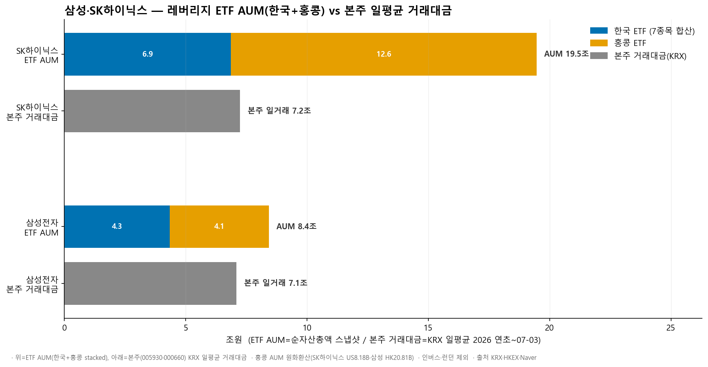
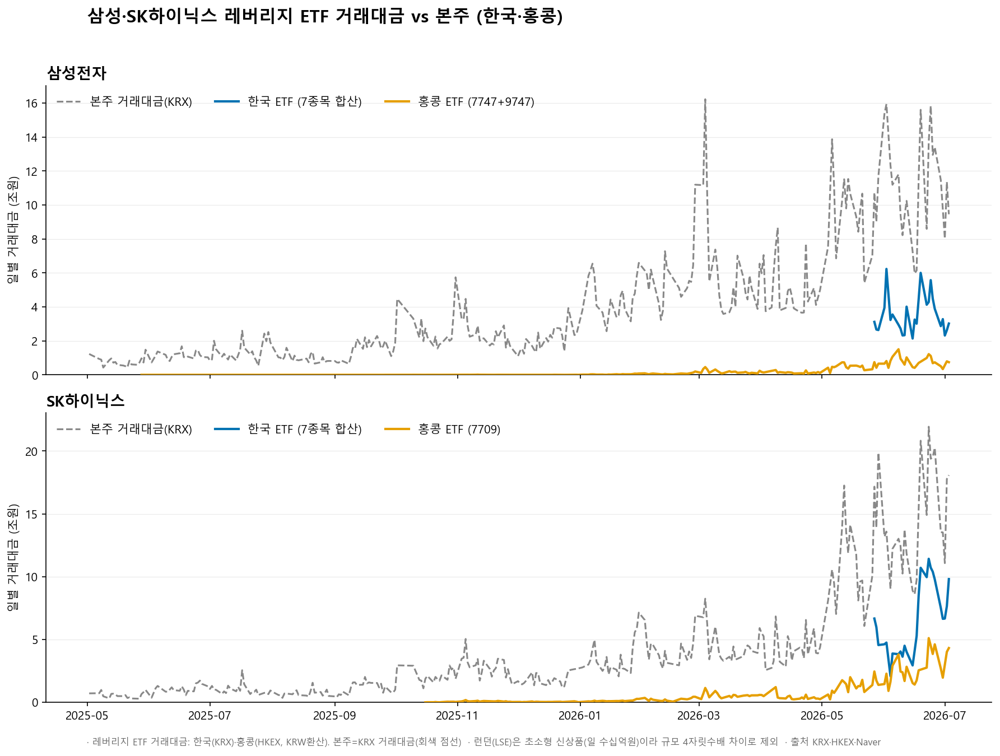
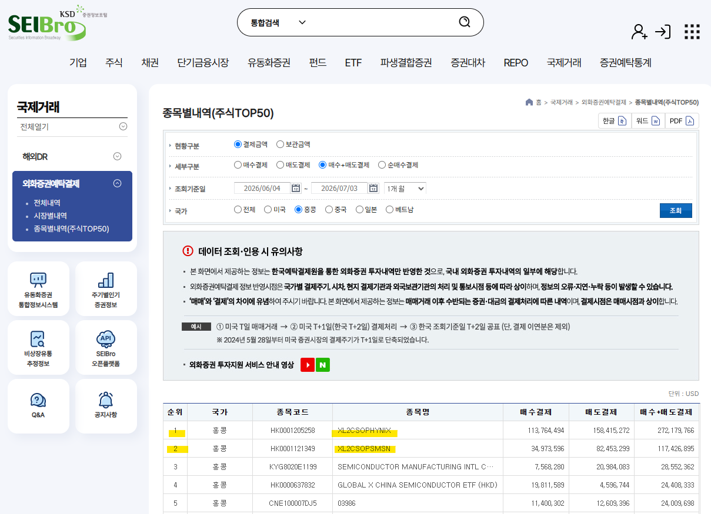
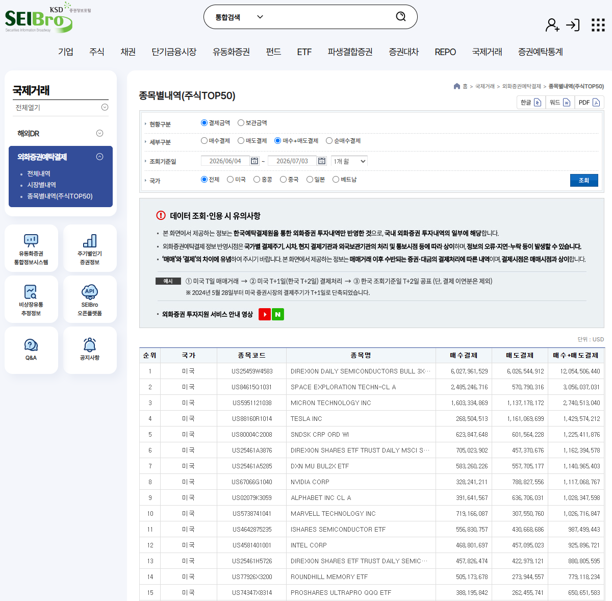
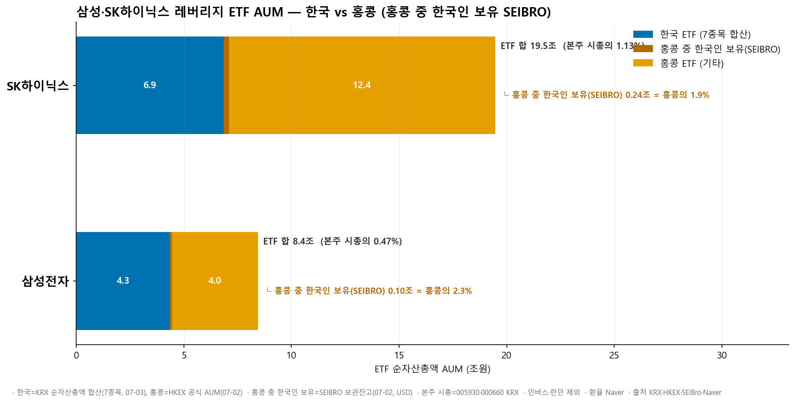
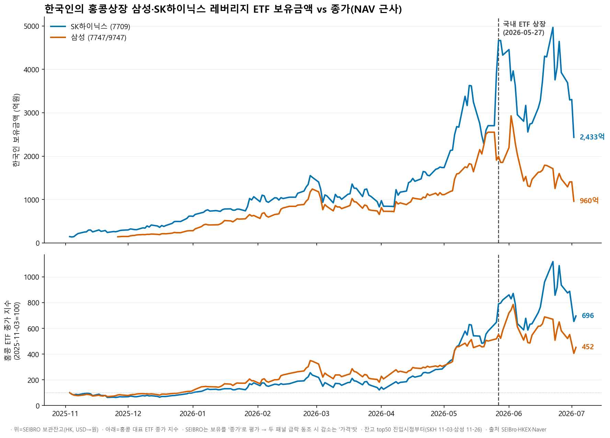
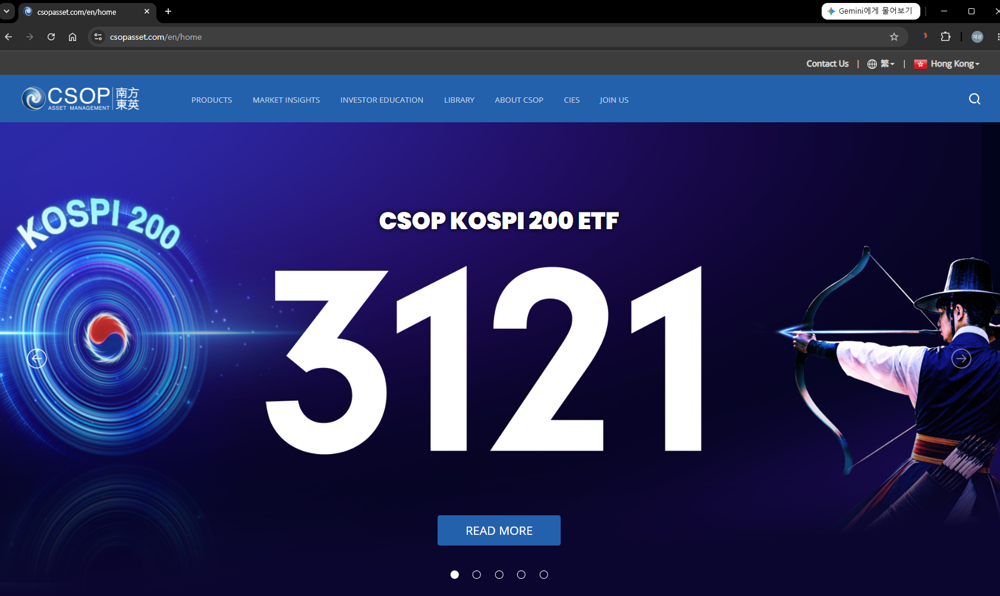

# 삼성·SK하이닉스 단일종목 레버리지, 한국·홍콩·런던으로 쪼개 봤습니다

## 두 종목에 2배로 거는 돈, 대체 어디에 얼마나 있을까

요즘 시장에서 가장 뜨거운 논쟁거리 중 하나가 **단일종목 레버리지 ETF**입니다. 삼성전자와 SK하이닉스 하루 수익률을 2배로 따라가는 이 상품을 두고, 시장을 흔든다며 상장폐지까지 거론될 정도로 목소리가 큽니다. 블룸버그도 한국의 이 현상을 기사로 다뤘습니다.

블룸버그가 정리한 6월 29일자 그림은 종목별로 "단일종목 레버리지·인버스 상품의 총자산(AUM)"과 "본주의 하루 거래대금"을 나란히 놓은 것입니다. 그런데 이 AUM 안에는 한국뿐 아니라 해외에 상장된 물량도 섞여 있습니다. 그래서 이 상품을 조금 더 정확히 들여다보기 위해, **같은 6월 29일 기준을 상장 거래소별로 직접 쪼개 봤습니다**. 삼성전자와 SK하이닉스 2배 레버리지가 한국(KRX), 홍콩(HKEX), 런던(LSE) 세 곳에 상장돼 있기 때문입니다.

## 데이터는 이렇게 잡았습니다

수치는 각 거래소 홈페이지에서 직접 추출했습니다. 가격과 거래대금은 KRX(한국거래소), HKEX(홍콩거래소), LSE(런던증권거래소)에서 가져왔고, 자산규모(AUM)는 여기에 더해 **발행사 홈페이지에서 한 번 더 검증**했습니다. 통화가 다른 홍콩(HKD·USD)과 런던(USD) 값은 네이버페이 증권(네이버 파이낸스)에서 **해당 일자에 매칭되는 환율**을 찾아 원화로 환산했습니다. 홍콩은 같은 펀드를 통화만 달리해 두 번 상장한 듀얼카운터(예: 삼성 2배의 7747·9747)가 있어, 자산규모는 중복 합산하지 않고 한 번만 반영했습니다.

## 먼저 자산 규모(AUM)로 봤습니다

거래소별로 자산 규모를 쌓아 보면 그림이 분명합니다.

위쪽 막대가 레버리지 ETF의 자산규모(한국+홍콩), 아래쪽 회색 막대가 본주의 하루 평균 거래대금입니다. **SK하이닉스는 홍콩(12.6조원)이 한국(6.9조원)의 거의 두 배**입니다. 반면 **삼성전자는 한국(4.3조원)과 홍콩(4.1조원)이 비슷한 수준**입니다. 두 종목을 합치면 홍콩이 16.7조원, 한국이 11.2조원으로, 자산의 60%가 홍콩에 있습니다.

참고로 런던에도 3배짜리(Leverage Shares)가 상장돼 있습니다. 다만 자산규모가 SK하이닉스는 1,545만 달러, 삼성전자는 199만 달러로, 홍콩 대비 각각 **약 530분의 1, 1,330분의 1** 수준입니다. 규모가 미미해 이번 비교에서는 제외했습니다.

여기서 한 가지는 짚고 넘어갈 만합니다. 지금 상장폐지까지 거론되는 대상은 **국내(KRX) 상품**입니다. 그런데 규모만 놓고 보면 정작 더 큰 쪽은 홍콩입니다. 국내 상품을 없앤다고 해서 "두 종목에 2배로 거는" 현상 자체가 사라지는 것은 아니고, 오히려 더 큰 홍콩 물량은 한국의 규제 밖에 그대로 남습니다. 단일종목 레버리지 상품 논의에는 이런 규모의 지형도 함께 놓고 볼 수 있지 않을까 합니다.

거래대금도 잠깐 보겠습니다.

위가 삼성전자, 아래가 SK하이닉스이고, 파란색이 한국 ETF, 주황색이 홍콩 ETF, 회색 점선이 본주의 거래대금입니다. 한국 ETF(파란색)는 상장일인 5월 27일부터 오른쪽 끝 5주만 그려지는데, 그 짧은 기간에 이미 본주(회색)에 육박하는 거래대금을 만들어 냅니다. 규모가 큰 만큼 거래도 활발하다는 점은 분명합니다.

## 만약 국내에서 사라진다면? 예탁원(SEIBRO)에서 힌트를 찾아봤습니다

상장폐지 주장의 바탕에는, 국내 상품을 없애면 그 거래도 함께 사라지리라는 기대가 깔려 있습니다. 그렇다면 실제로 없앴을 때 무슨 일이 벌어질지 미리 엿볼 방법이 있을까. 한국 투자자가 **이미 국경 밖에서 같은 상품을 어떻게 다루고 있는지**를 보면 힌트가 됩니다. 이건 한국예탁결제원의 증권정보포털 **SEIBRO**에서 확인할 수 있습니다. 국제거래 > 외화증권예탁결제 > 종목별내역(주식 TOP50) 메뉴입니다.

국가를 홍콩으로 두고 매수결제와 매도결제를 합친 금액으로 줄을 세우면, 한국 투자자가 홍콩에서 가장 많이 결제한 종목 1위와 2위가 각각 **SK하이닉스 2배(XL2CSOPHYNIX), 삼성전자 2배(XL2CSOPSMSN)**입니다. 최근 한 달 매수+매도 결제금액이 하이닉스 2억7,200만 달러, 삼성 1억1,700만 달러로, 3위인 중국 반도체(SMIC)를 크게 앞섭니다. 국내에 같은 상품이 버젓이 있는 지금도, 한국 투자자는 홍콩에 상장된 이 두 상품을 이미 가장 많이 사고팔고 있다는 뜻입니다.

국가를 전체로 넓혀 봐도 존재감이 있습니다.

미국의 반도체 3배 레버리지(SOXL), 마이크론, 테슬라, 엔비디아 같은 기라성 같은 종목들이 상위를 채운 가운데, **SK하이닉스 2배 ETF가 전 세계 33위**에 이름을 올립니다. 홍콩에 상장된 한국 반도체 레버리지가, 한국 투자자의 해외 결제 순위에서 미국 대형주들과 어깨를 나란히 한다는 뜻입니다. 레버리지를 향한 수요는 국내 상품이 처음 열어 준 것이 아니라, 원래 국경 밖에서도 왕성하게 흐르고 있었던 셈입니다.

그런데 "많이 결제한다"와 "많이 보유한다"는 또 다릅니다. 같은 SEIBRO에서 보관금액으로 확인해 보면, 홍콩 전체 자산 중 한국인이 차지하는 몫은 생각보다 작습니다.

홍콩 ETF 막대 안의 진한 부분이 한국인 보유분(SEIBRO 보관잔고)입니다. **SK하이닉스는 홍콩 자산의 1.9%, 삼성전자는 2.3%**에 그칩니다. 거래(결제)로는 상위권인데, 정작 쌓아 두고 보유한 몫은 2% 안팎이라는 것입니다. 홍콩 상품의 대부분은 한국인이 아니라 홍콩과 글로벌 자금이 들고 있고, 한국 투자자는 주로 사고파는 회전에 참여한다는 그림입니다.

그렇다면 국내 상품이 나온 뒤로 그 홍콩 창구는 줄어들었을까. 보유금액이 시간에 따라 어떻게 움직였는지 봤습니다.

위가 한국인의 홍콩 보유금액, 아래가 홍콩 대표 ETF의 종가입니다. 점선은 국내 2배 ETF가 상장된 5월 27일입니다. 보관금액은 국내 상품이 나오기 한참 전부터 꾸준히 늘어 6월에 정점을 찍었고, 7월 초에 급하게 꺾였습니다. 다만 아래 종가 패널을 함께 보면, 그 감소의 상당 부분은 **한국으로 자금이 넘어가서라기보다 종가(평가액) 자체가 급락했기 때문**입니다. SEIBRO 보관금액은 종가로 평가되기 때문에, 두 패널이 같은 시점에 함께 꺾였다는 것은 보유금액 감소가 상당 부분 가격 하락으로 설명된다는 뜻입니다. 국내 2배 ETF가 나왔다고 해서 홍콩 창구가 눈에 띄게 국내로 옮겨 온 흔적은 보이지 않습니다.

이 대목이 처음의 질문에 힌트를 줍니다. 국내와 홍콩이 서로를 대체하기보다 나란히 존재해 왔다면, 국내 상품을 없앤다고 해서 그 수요가 사라진다기보다 **이미 활짝 열려 있는 홍콩(과 미국) 창구로 옮겨 갈 여지가 크다**고 볼 수 있습니다. 없애서 사라지느냐, 자리를 옮기느냐는 다른 문제입니다.

## 덧붙임: 블룸버그의 삼성 규모, 한 번 더 세어진 걸까

글을 블룸버그 그림으로 시작했으니, 거래소별로 쪼갠 숫자를 다시 블룸버그와 맞춰 보겠습니다. 앞서 본 우리 값은 7월 초 기준이라 그사이 반도체 주가가 20%대로 빠진 것이 반영돼 있습니다. 그래서 우리 값을 다시 6월 29일 주가로 되돌려 비교했습니다.

| 구분 | 블룸버그(6/29) | 우리 값 6/29 환산 | 차이 |
|------|------|------|------|
| SK하이닉스 | 190.4억 달러 | 170억 달러 | 21억 달러 |
| 삼성전자 | 124.3억 달러 | 68억 달러 | 57억 달러 |

**SK하이닉스는 주가만 되돌리면 블룸버그와 거의 맞아떨어집니다.** 그런데 **삼성전자는 주가를 되돌려도 57억 달러가 비어 있습니다.** 주가 급락만으로는 설명이 되지 않는 것입니다.

여기서 한 가지 비대칭이 눈에 띕니다. SK하이닉스 홍콩 상품은 카운터가 하나뿐이라 중복해서 셀 여지가 없고, 실제로 차이도 작았습니다. 반면 **삼성전자 홍콩 상품은 HKD·USD 듀얼카운터**라, 같은 펀드를 통화만 달리해 두 줄로 상장한 것입니다. 이 둘을 각각 세면 홍콩 삼성 규모가 두 배로 잡힙니다. 삼성 홍콩을 한 번 더(약 34억 달러) 세면 우리 환산값이 102억 달러로 올라가고, 남는 차이가 22억 달러로 줄어 SK하이닉스(21억 달러)와 거의 같아집니다.

이 어긋남의 모양을 보면, **블룸버그의 삼성전자 규모는 홍콩 듀얼카운터를 한 번 더 세어 넣은 것으로 추정됩니다.** 물론 블룸버그 내부 집계 방식을 직접 확인한 것은 아니어서 단정하기는 어렵지만, 삼성에서만 유독 차이가 크고 그 크기가 딱 듀얼카운터 한 벌만큼이라는 점은 그렇게 볼 만한 정황입니다.

## 마무리: 방향은 어느 쪽일까

정리하면 이렇습니다. 삼성전자와 SK하이닉스에 2배로 거는 자산은 **국내보다 홍콩이 더 큽니다**(특히 SK하이닉스). 한국 투자자는 홍콩 상품을 활발히 거래하지만 보유 비중은 2% 안팎이고, 국내 상품 상장 이후에도 홍콩 물량이 급격히 한국으로 이동한 흔적은 뚜렷하지 않습니다.

그러던 차에, 홍콩에서 이 2배 레버리지를 운용하는 CSOP의 홈페이지를 오늘 들어가 봤더니 첫 화면이 이렇습니다.

한복 차림의 궁수와 태극 문양을 앞세운 **CSOP KOSPI 200 ETF** 광고가 가장 크게 걸려 있습니다. 홍콩의 운용사가 한국 시장을 정조준하고 있는 셈입니다. 국내 상품을 어떻게 다루든, 한국 자산을 겨냥한 상품은 이렇게 국경 밖에서 계속 만들어지고 있습니다. 규모의 무게 중심이 어디에 있는지를 보면, 앞으로 이 거래가 점점 더 밖에서 이뤄질 가능성도 배제할 수 없습니다.